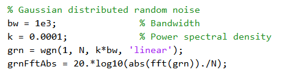

# 实验1——雷达信号产生与噪声分析

## 1.噪声信号的数学描述

### 1.1.均匀分布

$$
f(x)=
\begin{cases}
    \frac{1}{b-a},\ a<x<b \\
    f(x)=0,\ else
\end{cases}
$$

### 1.2.高斯分布

$$
f(x)=\frac{1}{\sqrt{2\pi}\sigma}exp(-\frac{(x-\mu)^2}{2\sigma^2})
$$

### 1.3.瑞利分布

$$
f(x)=\frac{x}{\sigma^2}exp(-\frac{x^2}{2\sigma^2}),x>0
$$

### 1.4.复高斯噪声与瑞利分布的关系

设正弦波加窄带高斯噪声的混合信号为

$$
r(t)=Acos({\omega}_c+\theta)+n(t)
$$

式中：$n(t)=n_c(t)cos\omega_ct-n_s(t)sin\omega_ct$，为窄带高斯噪声，其均值为$0$，方差为$\sigma^2_n$；$\theta$为正弦波的随机相位，在$(0,\ 2\pi)$上均匀分布；振幅$A$和$\omega_c$均假定为确知量。于是：

$$
r(t)=[Acos\theta+n_c(t)]cos\omega_ct-[Asin\theta+n_s(t)]sin\omega_ct \\
=z_c(t)cos\omega_ct+z_s(t)sin\omega_ct \\
=z(t)cos[\omega_ct+\phi(t)]
$$

其中：

$$
z_c(t)=Acos\theta+n_c(t) \\
z_c(t)=Asin\theta+n_s(t)
$$

$r(t)$的包络和相位分别为：

$$
z(t)=\sqrt{z_c^2(t)-z_s^2(t)},\ z\ge0 \\
\phi(t)=arctan\frac{z_s(t)}{z_c(t)}, \ 0{\le}z{\le}2\pi
$$

考察$r(t)$的包络和相位的统计特性，如果$\theta$值已给定，则$z_c$、$z_s$是相互独立的高斯随机变量，且有：

$$
E[z_c]=Acos\theta;\ E[z_s]=Asin\theta;\ \sigma_c^2=\sigma_s^2=\sigma_n^2
$$

故在给定相位$\theta$的条件下$z$与$\phi$的联合概率密度函数为：

$$
f(z_c,\ z_s/\theta)=\frac{1}{2\pi\sigma_n^2}exp\{-\frac{1}{2\sigma_n^2}[(z_c-Acos\theta)^2+(z_s-Asin\theta)^2]\}
$$

根据$z_c$，$z_s$与$z$，$\phi$之间的随机变量关系：

$$
z_c=zcos\phi;\ z_s=zsin\phi
$$

可以求得在给定$\theta$的条件下$z$与$\phi$的联合概率密度函数为：

$$
f(z_c,\ \phi/\theta)=f(z_c,\ z_s/\theta)\vert\frac{\partial(z_cz_s)}{\partial(z_s,\ \phi)}\vert=z{\cdot}f(z_c,\ z_s/\theta) \\
=\frac{z}{2\pi\sigma_n^2}exp\{-\frac{1}{2\sigma_n^2}[z^2+A^2-2Azcos(\theta-\phi)]\}
$$

然后求给定$\theta$条件下的边际分布，即：

$$
f(z/\theta)=\int_0^{2\pi}f(z_c,\ \phi/\theta)d\phi \\
=\frac{z}{2\pi\sigma_n^2}exp(-\frac{z^2+A^2}{2\sigma_n^2})\cdot\int_0^{2\pi}exp[\frac{Az}{\sigma_n^2}cos(\theta-\phi)]
d\phi
$$

由于：

$$
\frac{1}{2\pi}\int_0^{2\pi}exp[xcos\phi]d\phi=I_0(x)
$$

故有：

$$
\frac{1}{2\pi}\int_0^{2\pi}exp[\frac{Az}{\sigma_n^2}cos(\theta-\phi)]d\phi=I_0(\frac{Az}{\sigma_n^2})
$$

式中：$I_0(x)$为第一类零阶修正贝塞尔函数。

当$x\ge0$时，$I_0(x)$是单调上升函数，且有$I_0(0)=1$，因此：

$$
f(z/\theta)=\frac{z}{\sigma_n^2}exp(-\frac{z^2+A^2}{2\sigma_n^2}){\cdot}I_0(\frac{A_z}{\sigma_n^2})
$$

由上式可见，$f(z/\theta)$与$\theta$无关，故$r(t)$的包络$z$的概率密度函数为

$$
f(z)=\frac{z}{\sigma_n^2}exp(-\frac{z^2+A^2}{2\sigma_n^2}){\cdot}I_0(\frac{A_z}{\sigma_n^2}),\ z\ge0
$$

此概率密度函数称为**广义瑞利分布**，又称**莱斯分布**。其存在两种极限情况：

1. 当信号很小，即$A\to0$时，信号功率与噪声的比值$\gamma=\frac{A^2}{2\theta_n^2}\to0$，相当于$x$很小，于是有$I_0(x)=1$，莱斯分布退化为瑞利分布；
$$
f(z)\approx\frac{z}{\sigma_n^2}exp(-\frac{z^2}{2\sigma_n^2}),\ z\ge0
$$
2. 当信噪比$\gamma=\frac{A^2}{2\theta_n^2}$很大时，有$I_0(x)\approx\frac{e^x}{\sqrt{2{\pi}x}}$，这时在$z{\approx}A$附近，$f(z)$近似为高斯分布，即：
$$
f(z)\approx\frac{1}{\sqrt{2\pi}\sigma_n}exp(-\frac{(z-A)^2}{2\sigma_n^2})
$$

## 2.噪声信号产生

均匀分布噪声产生（matlab代码）

可见其时域波形图、直方图、频谱图。可以看到其直方图呈现出均匀分布的特征，在其频带内各频点能量分布均匀，符合白噪声特性

高斯分布噪声产生（matlab代码）

可见其时域波形图、直方图、频谱图。可以看到其直方图呈现出高斯钟形曲线特征，在其频带内各频点能量分布均匀，符合白噪声特性

瑞利分布噪声产生（matlab代码）

可见其时域波形图、直方图、频谱图。可以看到其直方图呈现出瑞利分布特征，在其频带内各频点能量分布均匀，符合白噪声特性

## 3.雷达信号产生与加噪

### 3.1 BPSK信号产生与加噪

matlab代码如下，码元为`1101010001`

产生的BPSK码元信号、调制后信号以及调制后信号的频谱

可以看出其频谱有明显的谐波特性，因其原始信号为正弦与方波相乘，方波的谐波成分反映到了调制后信号的频谱中。

现在对BPSK调制信号添加噪声。可明显看出其时域波形上的毛刺与尖峰。

### 3.2 LFM（Linear Frequency Modulation）信号产生与加噪

matlab代码如下

产生的LFM信号波形，以及其调制波形，能谱图和频谱图

可以看出其频谱也具有明显的谐波特性，因其原始信号为正弦与带斜率的线性波相乘，同时带有突变成分，突变成分意味着具有高频谐波，该谐波成分反映到了调制后信号的频谱中。

现在对LFM调制信号添加噪声。可明显看出其时域波形上的毛刺与尖峰。

## 4. LFM信号 HDL实现

使用Verilog HDL硬件描述语言编写LFM信号产生的仿真实验，系统框图如下:  

利用Cordic算法进行单周期快速正弦运算可以大幅提升正余弦计算速度。使用锯齿波作为控制信号，对VCO正弦进行调制即可得到LFM信号，仿真波形图如下:  

可以看到LFM信号产生效果极佳。

## 5. 总结

通过本实验，我们掌握了雷达信号与噪声信号的特征和数学描述，学会了使用Matlab对其进行仿真。

## 6. 参考

<https://blog.csdn.net/caoyuan666/article/details/106054959?utm_medium=distribute.pc_relevant.none-task-blog-searchFromBaidu-3.control&depth_1-utm_source=distribute.pc_relevant.none-task-blog-searchFromBaidu-3.control>

<https://blog.csdn.net/weixin_42845306/article/details/110529365>

<https://blog.csdn.net/Hsaver/article/details/110184154>

<https://blog.csdn.net/naturly/article/details/109052428>