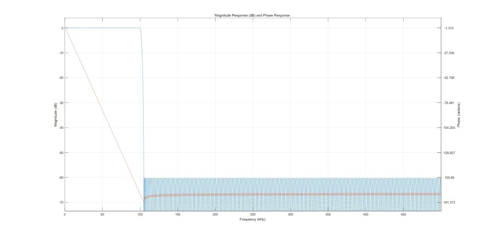

# 实验2——信号滤波与降噪

## 信号滤波

在数字雷达接收机中，往往需要对接收信号进行滤波处理。在数字域中作数字信号处理，一般使用数字滤波器。数字滤波器是对数字信号进行滤波处理以得到期望的响应特性的离散时间系统。作为一种电子滤波器，数字滤波器与完全工作在模拟信号域的模拟滤波器不同。数字滤波器工作在数字信号域，它处理的对象是经由采样器件将模拟信号转换而得到的数字信号。

数字滤波器的工作方式与模拟滤波器也完全不同：后者完全依靠电阻器、电容器、晶体管等电子器件组成的物理网络实现滤波功能；而前者是通过数字运算器件对输入的数字信号进行运算和处理，从而实现设计要求的特性。

数字滤波器理论上可以实现任何可以用数学算法表示的滤波效果。数字滤波器的两个主要限制条件是它们的速度和成本。数字滤波器不可能比滤波器内部的数字电路的运算速度更快。但是随着集成电路成本的不断降低，数字滤波器变得越来越常见并且已经成为了如收音机、蜂窝电话、立体声接收机这样的日常用品的重要组成部分。

数字滤波器一般由寄存器、延时器、加法器和乘法器等基本数字电路实现。随着集成电路技术的发展，其性能不断提高而成本却不断降低，数字滤波器的应用领域也因此越来越广。按照数字滤波器的特性，它可以被分为线性与非线性、因果与非因果、无限脉冲响应（IIR）与有限脉冲响应（FIR）等等。其中，线性时不变的数字滤波器是最基本的类型；而由于数字系统可以对延时器加以利用，因此可以引入一定程度的非因果性，获得比传统的因果滤波器更灵活强大的特性；相对于IIR滤波器，FIR滤波器有着易于实现和系统绝对稳定的优势，因此得到广泛的应用；对于时变系统滤波器的研究则诞生了以卡尔曼滤波为代表的自适应滤波理论。

在本次实验中，我们将使用数字信号处理的方法对雷达接收信号进行滤波与降噪处理。

## 使用FIR滤波器对信号降噪

使用Matlab的FilterDesign工具箱可以 方便地设计FIR（有限冲激响应滤波器）。待滤波的信号为加噪声的BPSK信号，载波频率为10kHz，根据该频段设计相应的FIR滤波器参数如下:  

|   阶数   |    396阶     |
| :------: | :----------: |
|  采样率  |     1MHZ     |
| 通带频率 |    10kHz     |
| 阻带频率 |    15kHz     |
| 阻带衰减 |     60dB     |
| 通带纹波 |     1dB      |
| 设计方法 | 等纹波设计法 |

以下是该FIR滤波器的幅频与相频特性曲线图: 


### 补偿FIR滤波引入的延迟

数字滤波器会在信号中引入延迟。根据滤波器特征，延迟可以在所有频率上保持不变，也可以随频率而变化。

通过按时间偏移信号，可以轻松补偿在所有频率上为常量的滤波器延迟。FIR 滤波器通常具有常量延迟。另一方面，随频率变化的延迟会导致相位失真，并显著改变信号波形。与频率有关的延迟的补偿并不像常量延迟那样无关紧要。IIR 滤波器就会引入与频率有关的延迟。

通过grpdelay函数测量FIR滤波器的延迟D，并通过在输入信号中追加D个零并按时间将输出信号偏移 D 个采样来补偿此延迟。

使用grpdelay查看该FIR滤波器群延迟，发现其为常量197.5（不随频率改变），取197为近似值，对其进行滤波延迟补偿。


在上述BPSK信号上所加的噪声类型为高斯白噪声，功率谱密度0.0001，原BPSK信号与加噪信号的波形图与频谱图如下:


使用上述FIR滤波器对其进行滤波处理，可滤除高频段的所有噪声信号:  


可以看出，使用FIR低通滤波能较好还原出BPSK原波形特性，**但是在相位翻转点的突变信号将丢失**。因为该翻转点的信息主要存在于高频成分中，高频成分被滤除，该翻转点被平滑。

接下来使用FIR滤波器对加噪LFM信号进行降噪。另行设计一FIR滤波器以匹配LFM信号特征，其幅频与相频特性曲线如下: 



产生的原始LFM信号的时域波形图、调制信号波形图与频谱图如下:


在上述LFM信号中添加高斯白噪声后，再使用前述FIR滤波器对其进行滤波降噪，得到如下结果。从上至下分别为加噪LFM信号、加噪LFM信号频谱、滤波后输出的LFM信号以及滤波后LFM信号的频谱。


### 信噪比

信噪比定义为信号功率与噪声功率的比率，数学定义如下:  
$$
SNR = {P_{signal} \over P_{noise}} = {A_{signal}^2 \over A_{noise}^2}
$$
统计滤波前后信号的信噪比，可用滤波输出波形减去原始波形后比上原始波形，将前后两项归一化，即可得到归一化信噪比。

## 小波变换降噪

小波变化的发展，承袭Gabor transform的局部化思想，并且克服了傅里叶和Gabor transform的部分缺陷，小波变换提供了一个可以调变的时频窗口，窗口的宽度(width)随着频率变化，频率增高时，时间窗口的宽度就会变窄，以提高分辨率．小波在整个时间范围内的振幅平均值为0，具有有限的持续时间和突变的频率与震幅，可以是不规则，或不对称的信号。

小波变换分成两个大类：离散小波变换（DWT） 和连续小波变换（CWT）。两者的主要区别在于，连续变换在所有可能的缩放和平移上操作，而离散变换采用所有缩放和平移值的特定子集。

小波变换降噪相比于传统的傅里叶变换滤波法而言，能更加完整地保留信号的局部特性。下面使用小波变换分别对加噪声BPSK和LFM信号进行降噪处理，并将结果与先前的低通滤波法得到的结果做对比。

Matlab提供了WaveLet工具箱，可用于1维、2维小波降噪。其用法为:

```matlab
XDEN = wdenoise(X, LEVEL)
```

在这里使用默认的小波，即sym4小波。synN小波也被称为`Daubechies最小非对称小波`。


使用贝叶斯降噪规则，该方法使用了一个阈值规则，该规则假设测量值具有独立的先验分布，由混合模型给出。因为在混合模型中，测量用于估计权重，所以这种方法对于更多的样本更有效。默认情况下，使用后验中值规则来评估风险。噪声估计规则使用`LevelIndependent`规则，即**基于最小尺度（最高分辨率）小波系数估计噪声的方差**。

小波降噪具体实现只需调用Matlab函数，比如：

```matlab
bpsk_n_f = wdenoise(bpsk_n,9 ,'NoiseEstimate','LevelInDependent');
```

下图从上往下分别是加噪声LFM信号、加噪LFM信号频谱、经过小波变换降噪后的LFM信号波形、小波变换降噪后的LFM信号频谱。


在时域中对比2中降噪方法:


可以看出在中间的平坦过渡带，小波变换将噪声信号完全滤除，相比之下低通滤波不可能做到这一点，因为宽带噪声在有用信号频段内也有能量。观察LFM信号的细节，由于LFM信号中我们只关心当前信号的频率和频率变化趋势，所以两种方式区别不大。

接下来在频域中对比2种方法: 


可以看出，低通滤波法直接将高频段信号全部衰减，无法保留信号的高频信息。而小波变换降噪可以较为完好地保存原始信号中的高频信息。


接下来使用小波降噪对加噪BPSK调制信号降噪，并对比降噪效果。下图中从上到下分别为加噪BPSK信号、加噪BPSK信号的频谱、小波降噪后的BPSK信号、小波降噪后的BPSK信号的频谱。


可以看出，小波变换非常好地保留了原始信号中的突变成分（相位翻转点的突变），相应地，保留了原始信号的高频信息。同时对原波形还原效果也非常好。接下来对比2种方法还原出的信号与码元信号的对比。下图中从上到下依次是BPSK调制信号、低通滤波法还原出的BPSK调制信号、小波变换降噪法还原出的BPSK信号、码元信号。


可以看出，小波变换在BPSK信号降噪上有非常明显的优势。再在频域中对比：


可以看出，低通滤波法无法保留高频信息，而小波降噪法最真实地保留了原始信号的所有信息。

## 信噪比分析

|   信号类型   |    降噪方法    | 原始信噪比 | 降噪后信噪比 |
| :----------: | :------------: | :--------: | :----------: |
| 加噪BPSK信号 | FIR低通滤波法  |   6.95dB   |    9.08dB    |
| 加噪BPSK信号 | 小波变换降噪法 |   7.12dB   |   17.07dB    |
| 加噪LFM信号  | FIR低通滤波法  |   4.01dB   |    7.47dB    |
| 加噪LFM信号  | 小波变换降噪法 |   4.01dB   |    8.37dB    |

如果单纯地使用信噪比估计降噪效果，将有失偏颇。因为在信号解调的过程中，噪声并不是唯一的对信号解调产生影响的决定性因素。但还是可以从SNR前后变化看出哪种降噪方法更优。

## 总结

通过本次实验，我们掌握了数字滤波器的设计步骤，掌握了小波变换降噪的基本思想，学会了使用Matlab对信号进行滤波与降噪。

## 参考

[Matlab - Adaptive Noise Canceling Theory](https://ww2.mathworks.cn/help/dsp/ug/adaptive-noise-canceling-anc-applied-to-fetal-electrocardiography.html)

[Matlab - 滤波器设计库-参考文档](https://ww2.mathworks.cn/help/signal/ug/filter-design-gallery.html#FilterDesignGalleryExample-11)

[Matlab - 数字滤波器设计实践](https://ww2.mathworks.cn/help/signal/ug/practical-introduction-to-digital-filter-design.html)

[Matlab - Wavelet Denoising](https://ww2.mathworks.cn/help/dsp/ug/wavelet-denoising.html)


