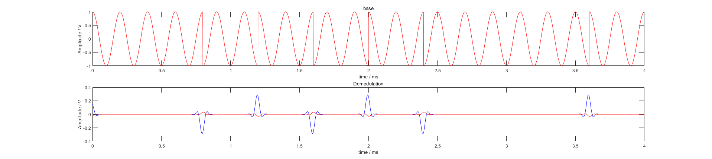

# 实验3——数字下变频（DDC）

## 模拟下变频的局限性与数字下变频的优点

在ADC采样率并不高的时代，通信接收机中的下变频通常由模拟电路完成，即使用正交相参本振信号与中频信号混频，分别得到低频的I、Q分量，经过低通滤波器滤除高频镜频后再用ADC采样并处理。其结构框图如下:

其优点是不需要高采样率的ADC，但缺点也是显而易见的——

- 模拟乘法器参数不匹配，导致输出 **镜频抑制比不高**，且存在非线性误差；
- 本振时钟源频率不稳定，随电路工作环境变化；除非使用温补晶振等时钟源
- 电路结构复杂，成本高；

随着技术的发展，高速高精度ADC的诞生使得数字正交采样下变频变得可能。如下图所示:

如图，使用高速ADC直接对滤波后的中频信号进行采样，后在数字域中对中频信号进行正交解调下变频。数字下变频的方法解决了模拟电路参数杂散性的问题，同时更加稳定、精确、低功耗、低成本，还可以简化电路结构。现在这种方式成为了主流。

比如ADI公司旗下的Linear Technology生产的LTC2208中频直采ADC，拥有130MSa的采样率和700M的全功率模拟带宽，且具有16位的量化位数，非常适用于中频采样数字下变频场合。

## 数字下变频的实现方法

### 1. 低通滤波法

低通滤波法是最传统的数字下变频方法，它所做的不过是将传统模拟域的操作转移至数字域进行，使用数字生成的正交信号具有幅频稳定的特性，且数字乘法操作具有高度一致性，不存在模拟乘法器的参数不匹配问题。在数字域中，设计具有精确的低通滤波器是非常简单的。故这种方法能达到比模拟域下变频更优的效果。

### 2. 插值法

同低通滤波法一样，中频信号经过ADC采样输出的序列经过符号修正后，偶数项位同相支路信号，奇数项为正交支路信号，两支路输出序列相差一个采样周期。要想获得相同时刻的IQ分量，可以对I支路进行延时，对Q支路内插奇数项，再经过统一抽取得到同一时刻的IQ信号。

最常用的插值算法之一是 **贝塞尔插值法**，贝塞尔中点插值公式:
$$
p({{x_0+x_1}\over 2}) = {1\over 2}(y_0+y_1)+{1\over 16}(-y_{-1}+y_0+y_1-y_2) \\
+ {3\over 256}(y_{-2}-3y_{-1}+2y_0+2y_1-3y_2+y_3) \\
+ {5\over 2048}(y_{-3} + 5y_2-9y_{-1}+5y_0+5y_1-9y_2+5y_3+y_4) + ... \\
当内插阶数为4阶时: \\
p({{x_0+x_1}\over 2}) = {1\over 16}(-y_{-1}+9y_0+9y_1-y_2) = \\
{1\over 16}[9(y0+y_1) - (y_{-1} + y_{-2})]
$$
插值法有一硬件快速实现的快速计算方法，如下图所示:

如果采用直接计算，需要5次除法、3次加法、1次减法。用右图所示的快速算法实现，只需要1次乘法、1次除法、3次加法、1次减法。

### 3. 多相滤波法

多相滤波本质上是采用抽取的方式，利用多个低阶FIR滤波器代替一个高阶FIR滤波器，从而达到降低运算量、减小运算延迟的效果。本次实验仅对多相滤波法进行简要了解，并没有在matlab中实验。

## 数字下变频实验

### 1.单载频脉冲

单载频脉冲，使用低通滤波法进行正交解调，下图中从上至下依次为: 原信号（IQ）、调制信号、调制信号频谱、重采样信号、解调信号（IQ）

分别对比低通滤波法和插值法，得到如下结果，从上至下依次为：原信号、低通滤波法解调信号、原信号、插值法解调信号。

可以看出，2种解调方式都能很好地还原原信号。插值法在波形间断点的过渡不如低通滤波法平滑。

### 2.BPSK信号

下面展示了BPSK信号的2种解调方法得到的结果。从上至下依次为：原BPSK调制信号、低通滤波法解调信号、原BPSK调制信号、插值法解调信号。

可以看出，低通滤波法在还原带有快速突变信号的时候效果并不佳，不排除是低通滤波器的参数整定问题。插值法仍然表现优异。

### 3.LFM信号

下面展示了LFM信号的2种解调方法得到的结果。从上至下依次为：原LFM调制信号、低通滤波法解调信号、原LFM调制信号、插值法解调信号

可以看出，低通滤波法和插值法均能有效还原信号。插值法在波形间断点的过渡不如低通滤波法平滑。

## 下变频质量分析

**皮尔逊积矩相关系数**用于度量2个变量X和Y之间的相关程度（线性相关）。我们在这里使用皮尔逊相关系数对比下变频质量。

| 下变频法 | 低通滤波法 | 低通滤波法 | 低通滤波法 | Bessel插值法 | Bessel插值法 | Bessel插值法 |
| :------: | :--------: | :--------: | :--------: | :----------: | :----------: | :----------: |
|   通道   |     Q      |     I      |    Q-I     |      Q       |      I       |     Q-I      |
|  单载频  |   0.9880   |   0.9963   |   0.0083   |    0.9817    |    0.9871    |    0.0054    |
|   LFM    |   0.9906   |   0.9910   |   0.0004   |    0.9778    |    0.9755    |    0.0023    |
|   BPSK   |  -0.0912   |  -0.0984   |   0.0072   |    0.9832    |    0.9758    |    0.0074    |

对比系数表，实际上很难看出哪种下变频方法在所有信号类型面前能始终保持高解调水准。在实际工程运用种，往往需要多次实验以确定对于某一特征信号应该具体采用何种数字下变频方法为最优解。

## 总结

本次实验我们掌握了下变频解调的基本原理，学会了

# 参考

[LTC2208 Datasheet](https://www.analog.com/media/en/technical-documentation/data-sheets/2208fc.pdf)

[Direct Down-Conversion System with I/Q Correction - Texas Instruments](https://www.ti.com/lit/ug/slwu085/slwu085.pdf)

[Basics of Digital Down-Conversion in DSP](https://www.allaboutcircuits.com/technical-articles/dsp-basics-of-digital-down-conversion-digital-signal-processing/)

[The Polyphase Implementation of Interpolation Filters in Digital Signal Processing](https://www.allaboutcircuits.com/technical-articles/digital-signal-processing-polyphase-implementation-interpolation-filter-dsp/)

