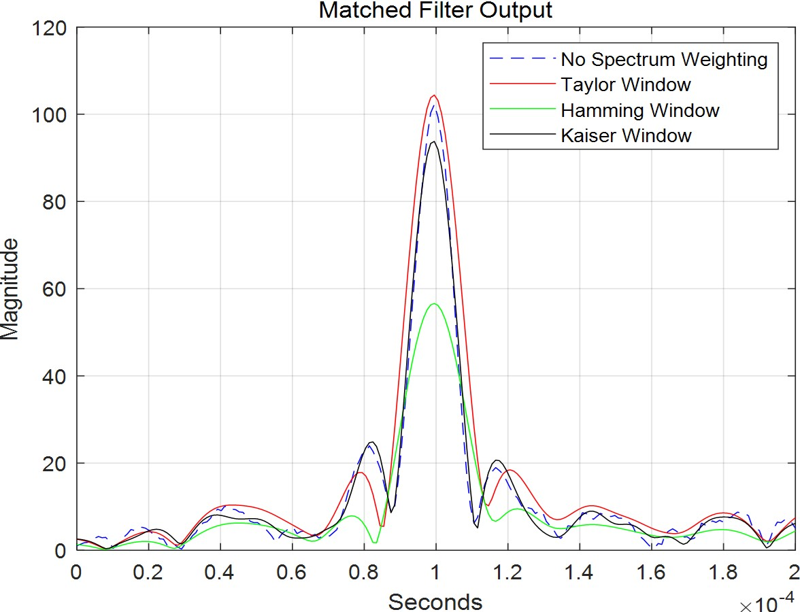

# 实验4——匹配滤波

## 匹配滤波器

在信号处理中，匹配滤波器可用来解调基频带脉冲信号，基频带脉冲信号意指信号内容为同一波形信号乘上一个常数，在每个周期出现，每个周期中代表着或多或少的信息量。**匹配滤波器解调出的结果具有最高的SNR。**

匹配滤波器需要先前知道:

- 发送的信号  

- 信号的同步  

  才能解调出传送的信号。

此外，匹配滤波器也可以用于模式识别、相似度测试。

## 最高SNR证明

假设:

- g(t) - 传送信号
- w(t) - 可加性高斯白噪声
- x(t) = g(t) + w(t)
- h(t) - 未知波形
- y(t) - 解调结果

$$
1.x(t) = g(t) + w(t) \\
2.y(t) = [g(t) = w(t)] * h(t) = g(t) * h(t) + w(t) * h(t) \\
 = G(t) + N(t) \\
3. SNR = |G(T)^2 / E[N^2(T)]|
$$

SNR = 信号瞬间功率 / 噪声平均功率，信号瞬间功率:
$$
|G(T)^2| = \int_{- \infty}^{+\infty}H(f)G(f)e^{j2\pi fT} df
$$
噪声平均功率:
$$
E[N^2(T)] = {N_0 \over 2} \int_{-\infty}^{+\infty}|H(f)|^2df
$$
SNR最大:
$$
SNR  = {{\int_{-\infty}^{+\infty}H(f)G(f)e^{j2\pi fT}df} \over {{N_0 \over 2}\int_{-\infty}^{+\infty}|H(f)|^2}df} \\
\leq {{\int_{-\infty}^{+\infty}|H(f)|^2}e^{j2\pi fT}df \int_{-\infty}^{+\infty} |G(f) e^{j2\pi fT}|^2df \over {{N_0 \over 2}\int_{-\infty}^{+\infty}|H(f)|^2}df} = {2\over N_0} \int_{-\infty}^{+\infty}|G(f)|^2df
$$
当
$$
H_{opt}(f) = k|G(f)e^{j2\pi fT}|^*, SNR_{max} = {2\over N_0} \int_{-\infty} ^ {+\infty}|G(f)|^2df
$$
所以
$$
h_{opt}(t) = k\int_{-\infty} ^ {+\infty}G(-f)e^{-j2\pi fT}e^{j2\pi ft}df \\
=k\int_{-\infty} ^ {+\infty}G(z)e^{-j2\pi f(T-t)}dz \\
= kg(T - t)
$$
**柯西·施瓦茨不等式**:
$$
若 \int_{-\infty} ^ {+\infty}|A(x)|^2dx \lt \infty 且\int_{-\infty} ^ {+\infty}|B(x)|^2dx \lt \infty \\
则|\int_{-\infty} ^ {+\infty}A(x)B(x)dx|^2 \le \int_{-\infty} ^ {+\infty}|A(x)|^2dx \int_{-\infty} ^ {+\infty}|B(x)|^2dx
$$
当A = kB*时，等号成立。

## 单频正弦信号匹配滤波

雷达所发射的最简单的信号就是一恒定频率的单频正弦脉冲，实质上是一载波与矩形函数相乘，脉冲间断发射。当发射出去的信号照射到目标时，目标产生回波信号，雷达接收到回波信号之后经过匹配滤波处理，可得到易于甄别的回波信号:

红色为雷达发射信号，2个蓝色为回波信号（2个目标）

2个回波信号经过匹配滤波后的波形，可以看到他们并没有被**'压缩'**，反而被**'展宽'**了。当2个探测目标距离非常近时，回波信号几乎要互相重叠:

如果这时使用匹配滤波处理，会发现2信号匹配滤波输出将会产生重叠，导致无法辨识目标。

由此可导出该雷达的距离分辨率:
$$
距离分辨率 = {1\over 2}cT, T为脉冲宽度，c为光速（电磁波速度）
$$
也可以得出结论，要想增加距离分辨率，需要减小脉冲宽度。

## 能量关系

连续发射波时雷达传输的能量为 $P(t) = |s|^2(t)$,单频脉冲的能量为:
$$
E = \int_0^T P(t)dt = A^2T.
$$
类似地，接收到的回波能量为$E_r = K^2A^2T$.如果$\sigma$是噪声的标准差，那么接收端的SNR为:
$$
SNR = {E_r \over \sigma^2} = {K^2A^2T \over \sigma^2}
$$
可以看出，发射的脉冲宽度越长，信噪比越高。但是这样会**同时减小距离分辨率**。反过来也是同理。

## 更好的脉冲信号-线性调频脉冲

我们既想提高雷达作用的距离（提高信噪比），又想增大雷达的距离分辨率，这时我们就需要**脉冲压缩**技术来解决这个困难。基本原则如下:

- 信号发射的脉宽足够长（确保更高的能量被发射出去）
- 发射的信号经过精心设计，这样它经过匹配滤波之后，它的互相关信号的脉冲宽度将大大缩短，这样就不至于在2个相隔很近的目标回波中发生重叠。这就是为什么这项技术被称为 **脉冲压缩** 。

在雷达或声纳系统中，**线性调频（Linear Frequency Modulation）**信号是最常用的用于脉冲压缩的波形。

上图为LFM信号，以及LFM信号经过脉冲压缩后的波形。

经过理论推导可得出，LFM信号经过脉压后的互相关信号有如下形式:
$$
<s_c', s_c'>(t) = A^2T \Lambda {t\over T} sinc [\Delta ft \Lambda({t \over T})] e^{2\pi f_0t}
$$
可以看出，其具有辛格函数包络形状。这意味着其除开大主瓣外，具有众多小旁瓣。如果不对这些旁瓣进行处理，在多目标回波的情景下，强目标的回波经脉压后的旁瓣可能会淹没弱目标的回波经脉压后的主瓣。这时可以用窗函数对脉压前的信号进行加窗处理，常用的比如 **Kaiser Window， Hamming Window， Taylor Window，Blackman Window**等。

## 匹配滤波-脉冲压缩实验

生成一LFM信号，并对其加上高斯白噪声，然后对其进行脉冲压缩处理。

匹配滤波时，采用3种不同的窗函数施加于其上作为对比。可以看出Hamming窗对旁瓣抑制最强，但同时会对主瓣有所衰减。Taylor窗的综合素质最优，既能维持主瓣能量，又可以一定程度上衰减旁瓣。

## 匹配滤波用于提高信噪比

匹配滤波还有一重要用途就是提高信噪比。设计一实验，建立单基地雷达模型，在远处放置一目标，用雷达波去照射目标后，接收目标的回波。

如果回波不经过处理，仅仅简单滤波，很难判断目标的精确位置区间。如果采用匹配滤波的方法对其滤波，就可以最大化信噪比从而得出最可信的位置估计。

## 匹配滤波（脉压）测距与多普勒估计

设计一实验，建立单基地雷达模型，雷达坐标位于（0，0，0），目标坐标位于（5000，5000，0），目标速度矢量（25，25，0），散射截面积RCS=1㎡.使用LFM信号作为雷达发射信号，对接收信号进行匹配滤波处理。进行64次非相干累积用以提高多普勒分析分辨率。

得到的速度-距离联合模糊图如下:

得到的距离脉压回波如下:

可以看出，其位置估计区间为6000至8000米，速度估计为-40m/s左右。

对回波进行多普勒频移分析，可得到频谱如下:

取其峰值作为频偏，可根据此值估算目标速度。

## 总结

通过本次实验，我们掌握了匹配滤波在雷达信号处理中的应用，以及脉冲压缩——匹配滤波的特殊应用。我们还掌握了各种窗函数的特性，学会了利用脉冲压缩进行测距、测速的方法。

# 参考

[Pulse Compression](https://en.wikipedia.org/wiki/Pulse_compression)

[Matched Filtering](https://zh.wikipedia.org/wiki/%E5%8C%B9%E9%85%8D%E6%BF%BE%E6%B3%A2%E5%99%A8)

[Estimate Range and Doppler Using Pulse Compression](https://ww2.mathworks.cn/help/phased/ug/pulse-compression-using-phased-system-objects.html)

[Matlab - Matched Filtering](https://ww2.mathworks.cn/help/phased/ug/matched-filtering.html)

